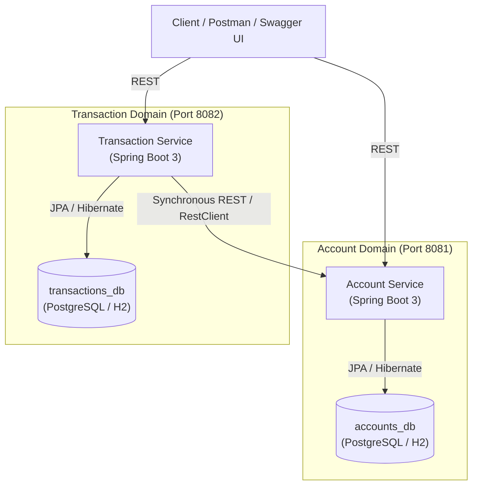
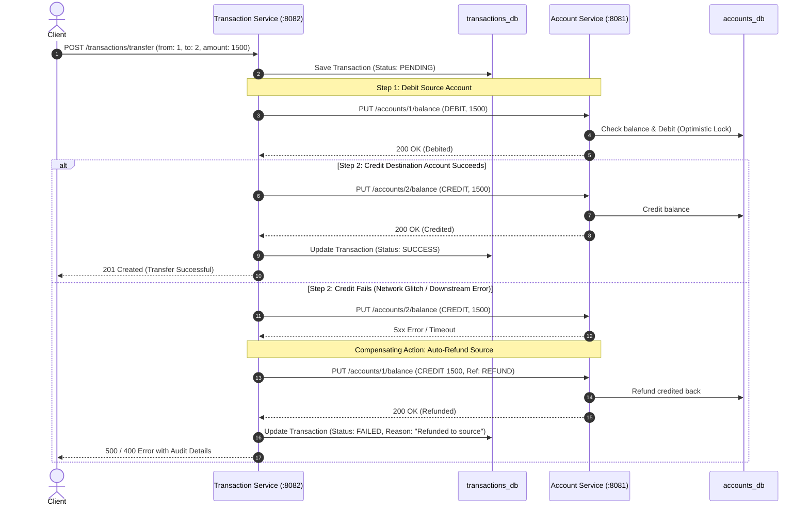
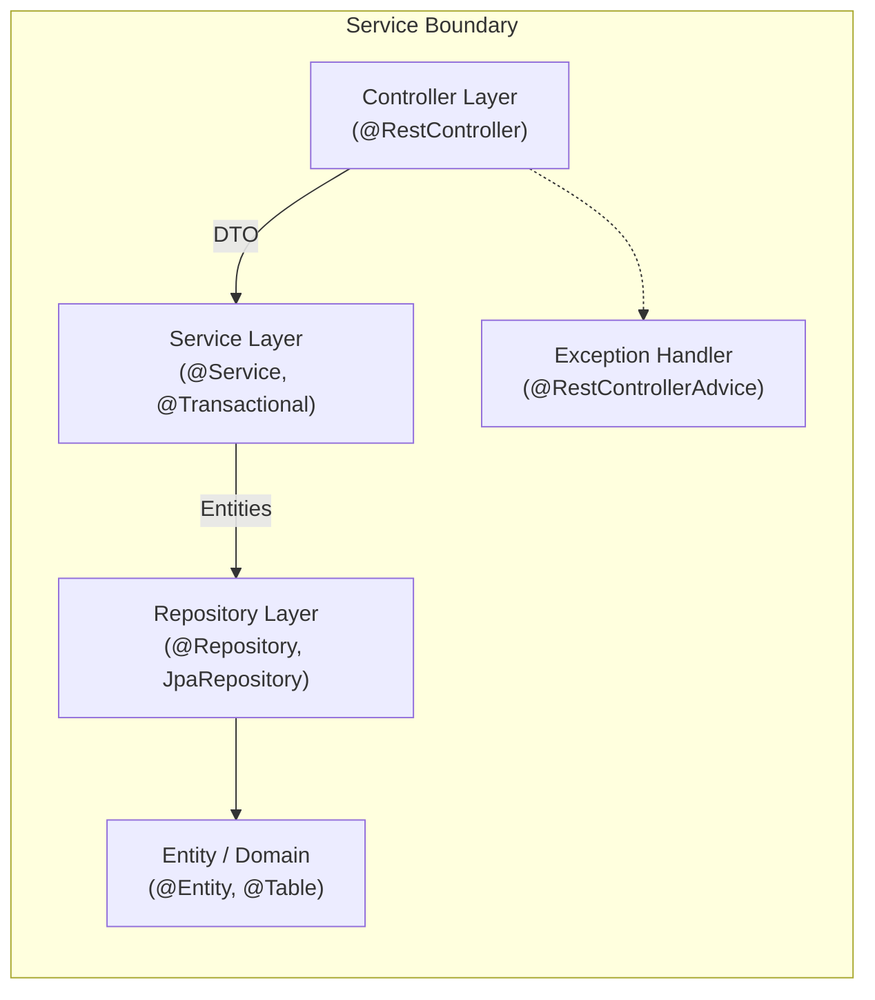

# BankEase — Core Banking Microservices Platform

[](https://www.oracle.com/java/)
[](https://spring.io/projects/spring-boot)
[](https://www.docker.com/)
[](LICENSE)
[](#1-high-level-architecture)

BankEase is an enterprise-grade core banking backend platform built as independent, loosely coupled microservices. It models essential retail banking operations: customer account lifecycle, balance ledger management, deposits, cash withdrawals, and two-party fund transfers with distributed compensation guarantees.

> **Domain**: Enterprise Core Banking & Fintech Microservices  
> **Key Disciplines**: Java 17, Spring Boot 3.x, Spring Data JPA, Microservices Architecture, Database-per-Service (PostgreSQL / H2), RESTful APIs, Docker containerization, and Optimistic Locking.

---

## 1. High-Level Architecture

The platform follows the **Database-per-Service** pattern. Each microservice manages its own relational database schema and communicates synchronously over HTTP/JSON using modern Spring 6 `RestClient`. The Transaction Service never queries or mutates the Account database directly.



---

## 2. Microservices Breakdown

| Service | Port | Database | Primary Responsibility |
| :--- | :---: | :---: | :--- |
| **`account-service`** | `8081` | `accounts_db` | Customer onboarding, account retrieval, real-time balance queries, and atomic debit/credit operations with concurrency control. |
| **`transaction-service`** | `8082` | `transactions_db` | Deposits, withdrawals, 2-legged fund transfers, and immutable transaction audit ledger. |

---

## 3. Transaction Workflow & Distributed Compensation

In a distributed microservice topology without distributed database locks (2PC), fund transfers between two accounts must ensure eventual consistency. BankEase implements an **orchestrated compensation workflow**:



---

## 4. Layered Clean Architecture (Per Microservice)

Each microservice adheres to strict separation of concerns:



- **Controller**: Validates incoming request shapes (`@Valid`, Jakarta validation), returns standardized `ApiResponse<T>`, and exposes OpenAPI metadata.
- **Service**: Executes business logic, enforces balance bounds, handles inter-service REST calls, and manages `@Transactional` boundaries.
- **Repository**: Spring Data JPA abstraction for CRUD and pagination.
- **Entity**: Relational table mappings with `@Version` optimistic locking to eliminate double-spending.
- **Global Exception Handler**: Intercepts domain exceptions (`AccountNotFoundException`, `InsufficientBalanceException`, `OptimisticLockingFailureException`) and formats RFC-7807 compliant error payloads.

---

## 5. Database Schemas

### 5.1 `accounts_db` — `accounts` Table
| Column | Type | Constraints | Description |
| :--- | :--- | :--- | :--- |
| `account_id` | `BIGINT` | `PRIMARY KEY, AUTO_INCREMENT` | Unique account identifier |
| `account_holder_name` | `VARCHAR(100)` | `NOT NULL` | Customer full name |
| `account_type` | `VARCHAR(20)` | `NOT NULL` | `SAVINGS` or `CURRENT` |
| `balance` | `DECIMAL(15,2)` | `NOT NULL, DEFAULT 0.00` | Real-time available ledger balance |
| `version` | `BIGINT` | `DEFAULT 0` | Optimistic locking version counter |
| `created_at` | `TIMESTAMP` | `NOT NULL, UP-TO-DATE` | Creation timestamp |
| `updated_at` | `TIMESTAMP` | `NULLABLE` | Last modification timestamp |

### 5.2 `transactions_db` — `transactions` Table
| Column | Type | Constraints | Description |
| :--- | :--- | :--- | :--- |
| `transaction_id` | `BIGINT` | `PRIMARY KEY, AUTO_INCREMENT` | Unique audit transaction ID |
| `from_account_id` | `BIGINT` | `NULLABLE` | Sender account ID (NULL for deposits) |
| `to_account_id` | `BIGINT` | `NULLABLE` | Recipient account ID (NULL for withdrawals) |
| `amount` | `DECIMAL(15,2)` | `NOT NULL, > 0` | Transaction value in INR |
| `transaction_type` | `VARCHAR(20)` | `NOT NULL` | `DEPOSIT`, `WITHDRAWAL`, or `TRANSFER` |
| `status` | `VARCHAR(20)` | `NOT NULL` | `PENDING`, `SUCCESS`, or `FAILED` |
| `failure_reason` | `VARCHAR(255)` | `NULLABLE` | Reason description if transaction failed |
| `description` | `VARCHAR(255)` | `NULLABLE` | User-defined transaction memo |
| `timestamp` | `TIMESTAMP` | `NOT NULL` | Ledger execution timestamp |

---

## 6. Core REST API Endpoints

### 6.1 Account Service (`http://localhost:8081`)
| Method | Endpoint | Description | Sample Status |
| :--- | :--- | :--- | :---: |
| `POST` | `/api/v1/accounts` | Create a new bank account | `201 Created` |
| `GET` | `/api/v1/accounts/{id}` | Get account metadata & balance | `200 OK` |
| `GET` | `/api/v1/accounts/{id}/balance` | Real-time balance inquiry | `200 OK` |
| `PUT` | `/api/v1/accounts/{id}/balance` | Internal: Atomic balance credit/debit | `200 OK` |
| `GET` | `/api/v1/accounts` | List all accounts (paginated) | `200 OK` |

### 6.2 Transaction Service (`http://localhost:8082`)
| Method | Endpoint | Description | Sample Status |
| :--- | :--- | :--- | :---: |
| `POST` | `/api/v1/transactions/deposit` | Deposit funds into an account | `201 Created` |
| `POST` | `/api/v1/transactions/withdraw` | Withdraw funds (checks balance) | `201 Created` |
| `POST` | `/api/v1/transactions/transfer` | 2-legged fund transfer with compensation | `201 Created` |
| `GET` | `/api/v1/transactions/account/{id}` | Account transaction history (paginated) | `200 OK` |
| `GET` | `/api/v1/transactions/{id}` | Get single transaction record | `200 OK` |

---

## 7. Interactive Documentation & Testing Tools

### 7.1 Live Swagger UI
- **Account Service Swagger**: [http://localhost:8081/swagger-ui.html](http://localhost:8081/swagger-ui.html)
- **Transaction Service Swagger**: [http://localhost:8082/swagger-ui.html](http://localhost:8082/swagger-ui.html)

### 7.2 Postman Collection
A pre-configured Postman collection is included in [`postman/BankEase_Postman_Collection.json`](postman/BankEase_Postman_Collection.json):
1. Open Postman ➔ Click **Import**.
2. Select `postman/BankEase_Postman_Collection.json`.
3. All requests (Happy Path and Edge Cases) are ready to execute with 1 click.

---

## 8. Getting Started & Running Locally

### Prerequisites
- **Java**: JDK 17 or higher
- **Maven**: 3.9+ (or use the included `./mvnw` wrapper)
- *(Optional)*: Docker & Docker Compose

---

### Option A: Local Dev Profile (Embedded In-Memory H2 — Zero Setup)
Run directly from terminal without setting up external databases:

```bash
# Terminal 1: Launch Account Service (Port 8081)
./mvnw spring-boot:run -pl account-service

# Terminal 2: Launch Transaction Service (Port 8082)
./mvnw spring-boot:run -pl transaction-service
```

---

### Option B: Native PostgreSQL
1. Ensure PostgreSQL is running on standard port `5432`.
2. Create databases:
   ```sql
   CREATE DATABASE accounts_db;
   CREATE DATABASE transactions_db;
   ```
3. Run services with the `postgres` active profile:
   ```bash
   ./mvnw spring-boot:run -pl account-service -Dspring-boot.run.profiles=postgres
   ./mvnw spring-boot:run -pl transaction-service -Dspring-boot.run.profiles=postgres
   ```

---

### Option C: Containerized Deployment (Docker Compose)
To run the full stack (isolated PostgreSQL databases + both microservices):
```bash
docker-compose up -d --build
```
To inspect container status:
```bash
docker-compose ps
```
To shut down containers and networks:
```bash
docker-compose down -v
```

---

## 9. Automated Testing

Run the comprehensive test suite across all modules:
```bash
./mvnw clean test
```

### Verified Test Cases:
- **`account-service`** (`AccountServiceIntegrationTest`):
  - Account creation with initial deposit validation
  - Balance debiting and atomic balance calculation
  - Overdraft rejection (`400 Insufficient Funds`)
  - Non-existent account querying (`404 Not Found`)
- **`transaction-service`** (`TransactionServiceIntegrationTest`):
  - Successful deposit processing and status updating
  - Successful withdrawal processing
  - Insufficient funds withdrawal rejection
  - 2-Legged inter-account fund transfer
  - Self-transfer rejection (`fromAccountId == toAccountId`)

---


## 10. Project Repository Structure

```text
BankEase/
├── .mvn/wrapper/               # Maven wrapper distribution files
├── mvnw                        # Linux/macOS wrapper script
├── mvnw.cmd                    # Windows wrapper script
├── pom.xml                     # Parent multi-module POM
├── docker-compose.yml          # Multi-container orchestration
├── LICENSE                     # Apache 2.0 open source license
├── README.md                   # Complete architectural documentation
├── postman/
│   └── BankEase_Postman_Collection.json   # 1-click Postman API collection
├── account-service/
│   ├── Dockerfile
│   ├── pom.xml
│   └── src/
│       ├── main/java/com/bankease/account/
│       │   ├── AccountServiceApplication.java
│       │   ├── config/OpenApiConfig.java
│       │   ├── controller/AccountController.java
│       │   ├── dto/
│       │   ├── entity/Account.java, AccountType.java
│       │   ├── exception/GlobalExceptionHandler.java
│       │   ├── repository/AccountRepository.java
│       │   └── service/AccountServiceImpl.java
│       └── test/java/com/bankease/account/
│           └── AccountServiceIntegrationTest.java
└── transaction-service/
    ├── Dockerfile
    ├── pom.xml
    └── src/
        ├── main/java/com/bankease/transaction/
        │   ├── TransactionServiceApplication.java
        │   ├── client/AccountServiceClient.java
        │   ├── config/OpenApiConfig.java
        │   ├── controller/TransactionController.java
        │   ├── dto/
        │   ├── entity/Transaction.java, TransactionType.java, TransactionStatus.java
        │   ├── exception/GlobalExceptionHandler.java
        │   ├── repository/TransactionRepository.java
        │   └── service/TransactionServiceImpl.java
        └── test/java/com/bankease/transaction/
            └── TransactionServiceIntegrationTest.java
```

---

## 11. License
This project is open-source and licensed under the [Apache License 2.0](LICENSE).
