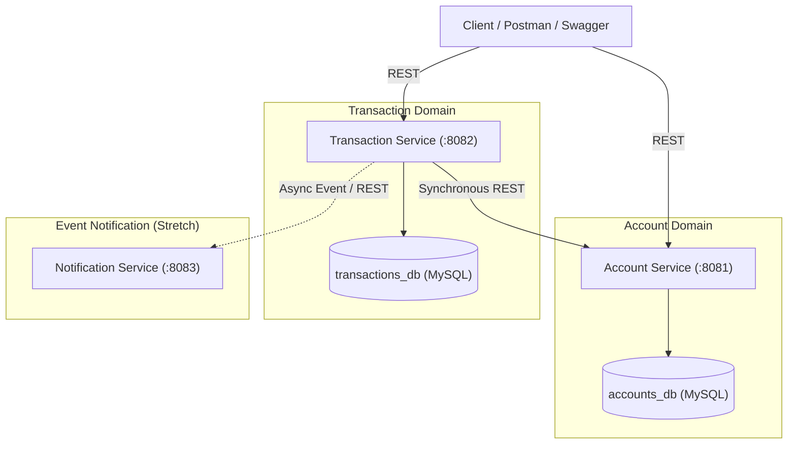

# BankEase: Core Banking Microservices Platform
## Implementation Plan & Architectural Roadmap

Prepared for: **Kotak Tech — Associate III Software Engineering Application**  
Document Source: [`BankEase_Project_Build_Plan.docx`](file:///c:/DRIVE1/Projects/Ongoing/BankEase/BankEase_Project_Build_Plan.docx)

---

### 1. Executive Summary & Objective

**BankEase** is a distributed core-banking backend microservices system demonstrating real-world banking domain workflows:
- **Account lifecycle & balance management**
- **Fund transfers, deposits, and withdrawals**
- **Independent database-per-service isolation**
- **Resilient synchronous REST inter-service communication**
- **Docker-ready containerization and orchestration**

The project is structured to directly mirror the technical requirements of the Kotak Tech Associate III SE profile: **Java 17 / Spring Boot 3.x, Spring Data JPA, Relational DBMS (MySQL/PostgreSQL), RESTful APIs, and Containerization**.

---

### 2. Environment Diagnostics & Technical Decisions

From the initial system scan on your machine:
- **Java**: `Java 25 LTS` is installed (`C:\Program Files\Java\jdk-25.0.2`). We will configure the Maven compiler target to Java 17 bytecode compatibility to strictly align with Kotak's JD while compiling effortlessly on your installed JDK.
- **Maven**: `Apache Maven 3.9.12` is globally installed and verified.
- **Docker**: Docker CLI is currently not detected in the system `PATH`. We will structure the project with an **H2 / local DB dev profile** so you can develop and test immediately without Docker, alongside standard **Dockerfiles and `docker-compose.yml`** for production/containerized deployment.
- **Database Selection**: The build plan mentions PostgreSQL in the table and MySQL in diagrams/checklists. We will use **MySQL** as the primary relational database (with Spring profiles supporting PostgreSQL or in-memory H2 for zero-overhead local testing).



---

### 3. Service Architecture & API Contracts

#### 3.1 Service 1: `account-service` (Port: 8081)
- **Role**: Source of truth for customer accounts and ledger balances.
- **Database**: `accounts_db` (Isolated schema)
- **Entity**: `Account`
  - `accountId` (BIGINT, PK, Auto-increment)
  - `accountHolderName` (VARCHAR(100), Not Null)
  - `accountType` (ENUM: `SAVINGS`, `CURRENT`)
  - `balance` (DECIMAL(15,2), Not Null, Default 0.00)
  - `version` (BIGINT - Optimistic locking for concurrent balance mutations)
  - `createdAt`, `updatedAt` (TIMESTAMP)

##### API Endpoints:
| Method | URI | Access | Description |
| :--- | :--- | :--- | :--- |
| `POST` | `/api/v1/accounts` | External | Create new bank account |
| `GET` | `/api/v1/accounts/{id}` | External | Retrieve account details |
| `GET` | `/api/v1/accounts/{id}/balance` | External/Internal | Check current balance |
| `GET` | `/api/v1/accounts` | External | List accounts with pagination |
| `PUT` | `/api/v1/accounts/{id}/balance` | Internal (TS only) | Debit or credit balance atomically |

---

#### 3.2 Service 2: `transaction-service` (Port: 8082)
- **Role**: Orchestrates deposits, withdrawals, and two-party fund transfers.
- **Database**: `transactions_db` (Isolated schema)
- **Entity**: `Transaction`
  - `transactionId` (BIGINT, PK, Auto-increment)
  - `fromAccountId` (BIGINT, Nullable for deposits)
  - `toAccountId` (BIGINT, Nullable for withdrawals)
  - `amount` (DECIMAL(15,2), > 0)
  - `transactionType` (ENUM: `DEPOSIT`, `WITHDRAWAL`, `TRANSFER`)
  - `status` (ENUM: `PENDING`, `SUCCESS`, `FAILED`)
  - `failureReason` (VARCHAR(255), Nullable)
  - `timestamp` (TIMESTAMP)

##### API Endpoints:
| Method | URI | Description |
| :--- | :--- | :--- |
| `POST` | `/api/v1/transactions/deposit` | Deposits funds into an account |
| `POST` | `/api/v1/transactions/withdraw` | Validates balance & withdraws funds |
| `POST` | `/api/v1/transactions/transfer` | Atomic 2-legged transfer between accounts |
| `GET` | `/api/v1/transactions/account/{accountId}` | Transaction history for a specific account |
| `GET` | `/api/v1/transactions/{id}` | Details of a single transaction |

---

#### 3.3 Fund Transfer Protocol & Failure Handling
Because `account-service` and `transaction-service` operate on different databases, a standard multi-service transfer must be handled safely:
1. `transaction-service` receives `TransferRequest(fromAccountId, toAccountId, amount)`.
2. Creates an audit record in `transactions_db` with status `PENDING`.
3. Calls `account-service` `PUT /accounts/{fromAccountId}/balance?action=DEBIT&amount=X`.
   - If insufficient funds or account invalid: Mark transaction as `FAILED` (Insufficient Funds), return 400.
4. Calls `account-service` `PUT /accounts/{toAccountId}/balance?action=CREDIT&amount=X`.
   - If credit fails (e.g. downstream network issue): Compensating transaction triggers a rollback credit to `fromAccountId`, marking transaction `FAILED` (Transfer Failed - Refunded).
5. Upon both legs succeeding, update transaction status to `SUCCESS`.

---

### 4. Implementation Phases

#### **Phase 0: Project Scaffolding & Root Configuration**
- Create root multi-module Maven structure:
  ```text
  BankEase/
  ├── pom.xml                     (Root parent POM defining dependencies & versions)
  ├── account-service/
  ├── transaction-service/
  ├── docker/
  │   ├── mysql-init/
  │   └── docker-compose.yml
  └── README.md
  ```
- Configure common dependencies: Spring Boot 3.3.x, Spring Data JPA, Lombok, Validation, Springdoc OpenAPI (Swagger), MySQL Connector, and H2 test profile.

#### **Phase 1: Account Service Development**
- Implement clean 4-tier layer:
  - `Account.java` with JPA validation & `@Version` optimistic locking.
  - `AccountRepository.java` extending `JpaRepository`.
  - `AccountService.java` with business validation (duplicate checks, negative balance guards).
  - `AccountController.java` with standard response envelope (`ApiResponse<T>`).
- Implement `@RestControllerAdvice` Global Exception Handler for `AccountNotFoundException`, `InsufficientBalanceException`, and Bean Validation errors.
- Test endpoints via Spring Boot test & curl/HTTP requests.

#### **Phase 2: Transaction Service & REST Client Integration**
- Implement `Transaction` entity, repository, and service.
- Build `AccountServiceClient` using modern Spring 6 / Spring Boot 3 `RestClient` (or `WebClient`) with:
  - Configurable target URL via `application.yml` (`http://localhost:8081` in local, `http://account-service:8081` in Docker).
  - Timeout configurations (Connect & Read timeouts).
  - Custom response error handler translating 4xx/5xx from Account Service to structured transaction failures.
- Implement `/deposit` and `/withdraw` operations.

#### **Phase 3: Cross-Service Transfer & Edge-Case Hardening**
- Implement `/transfer` logic with the compensation/rollback pattern.
- Add history endpoint: `/transactions/account/{accountId}` queryable by pagination.
- Verify corner cases:
  - Transferring more money than available balance.
  - Transferring to non-existent account ID.
  - Transferring from and to the same account ID (self-transfer validation).
  - Decimal rounding and precision checks (`BigDecimal`).

#### **Phase 4: Dockerization & Orchestration**
- Build multi-stage `Dockerfile` for each microservice (optimized layer caching, non-root user).
- Create `docker-compose.yml`:
  - `accounts-db` (MySQL container on internal network)
  - `transactions-db` (MySQL container on internal network)
  - `account-service` (depends_on DB healthcheck)
  - `transaction-service` (depends_on DB & account-service healthcheck)
- Provide environment variable overrides for database URLs and service ports.

#### **Phase 5: API Documentation & Kotak Interview Readiness**
- Integrate `springdoc-openapi-starter-webmvc-ui` for live interactive Swagger UI on:
  - `http://localhost:8081/swagger-ui.html`
  - `http://localhost:8082/swagger-ui.html`
- Generate Postman Collection (`BankEase_Postman_Collection.json`) for instant 1-click end-to-end testing.
- Formulate technical interview defense answers:
  1. *Why separate databases instead of sharing one?*
  2. *How is data consistency maintained without distributed 2PC?*
  3. *How are race conditions prevented during concurrent transfers?*

---

### 5. Kotak Interview Defense Cheat Sheet

| Question | Strong Architectural Answer |
| :--- | :--- |
| **Why Microservices instead of a Monolith?** | Domain boundaries: Account management has different scaling and availability characteristics than high-volume transaction processing. Database-per-service enforces loose coupling and independent schema migrations. |
| **How do you handle distributed transactions?** | Traditional 2-Phase Commit (2PC) creates blocking locks and single points of failure across microservices. In BankEase, we use orchestration with compensating actions: if debit succeeds but credit fails, an automatic reversing credit is issued, logged in the audit ledger. |
| **How do you prevent race conditions (double spending)?** | We employ JPA Optimistic Locking (`@Version` attribute) on the `Account` entity and database row locks during balance updates, ensuring concurrent requests detect conflicts and reject or retry safely. |
| **How do services find each other?** | In Docker Compose, via embedded Docker DNS service discovery. In enterprise Kubernetes/Spring Cloud, this can evolve to Spring Cloud Eureka / Consul or Kubernetes Services. |

---

### 6. Recommended Next Steps

1. **Scaffold the Maven Parent & Service Modules**: Generate standard Maven projects with Spring Boot 3 dependencies.
2. **Implement Account Service**: Get it compiled and running locally with swagger documentation.
3. **Implement Transaction Service**: Wire up the inter-service `RestClient`.

Please review this plan. Once approved, we will begin with Phase 0 and Phase 1!
